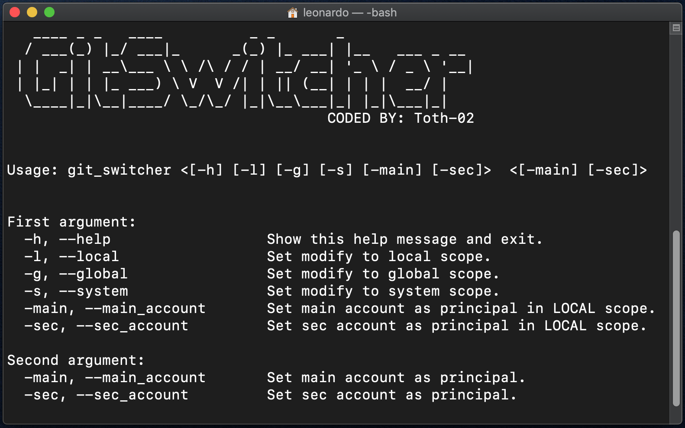

# GitSwitcher 
## ℹ️️ Description
A project created to solve a really common problem...switch from a git account to another during production of software.

## 🔧 How to Install and Use
Installing of **GitSwitcher** is really simple: 
 
- `nano install_and_update.sh`

- `chmod +x install_and_update.sh`
- `./install_and_update.sh`

Now you can simply type **git_switcher** in terminal to run the script!

## 🔧 How to Update
Update of **GitSwitcher** can be done in 2 ways: 
 
* ## Manual
  - Edit your terminal "profile file" (`.bash_profile`, `.profile` or `.bashrc`) and change the envinroment variables.
* ## Automatic
  - Edit `install_and_update.sh` **CONFIG** part.
  - `chmod +x install_and_update.sh`
  - `sudo ./install_and_update.sh`
  
## ⚠️ Attention
### Environment variables used by this program will cointain your git account informations, them can be accessed from anyone that can access to your currently user account, so make sure to logout when you will have a ☕ break!
